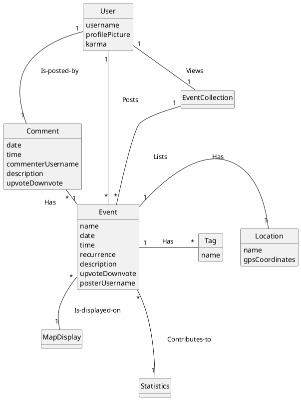

# Domain Model


#Posting an Event: A Sequence Diagram

```plantuml

@startuml
hide footbox
actor User as user
participant " : EventRepository" as repo
participant " : Event" as event
participant " : EventLocation" as evloc

user -> repo: create event

repo -->> event **: event = create(creator, date, time, description, location recurrence)
event -->> evloc **: evloc = (roughLocation)

evloc -->> event: finalLocation

repo -> user: Show Event
