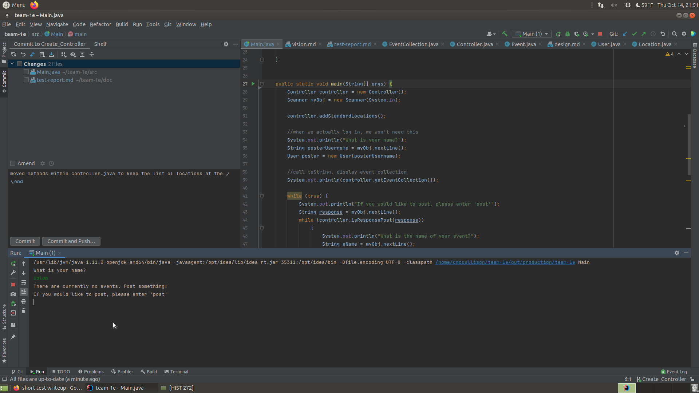
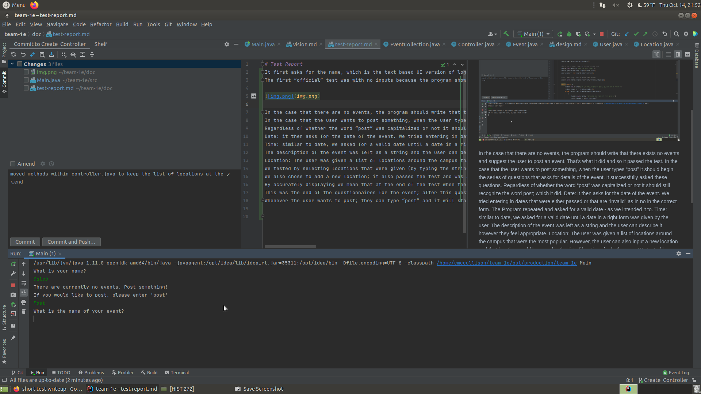
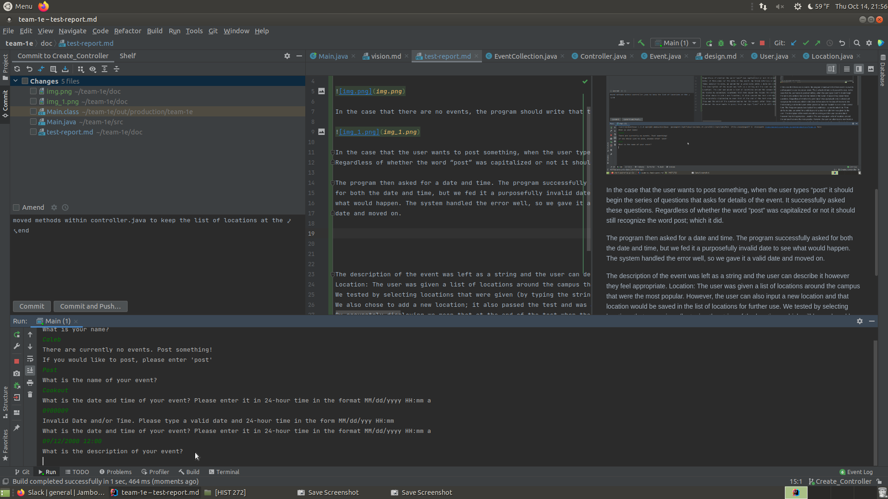
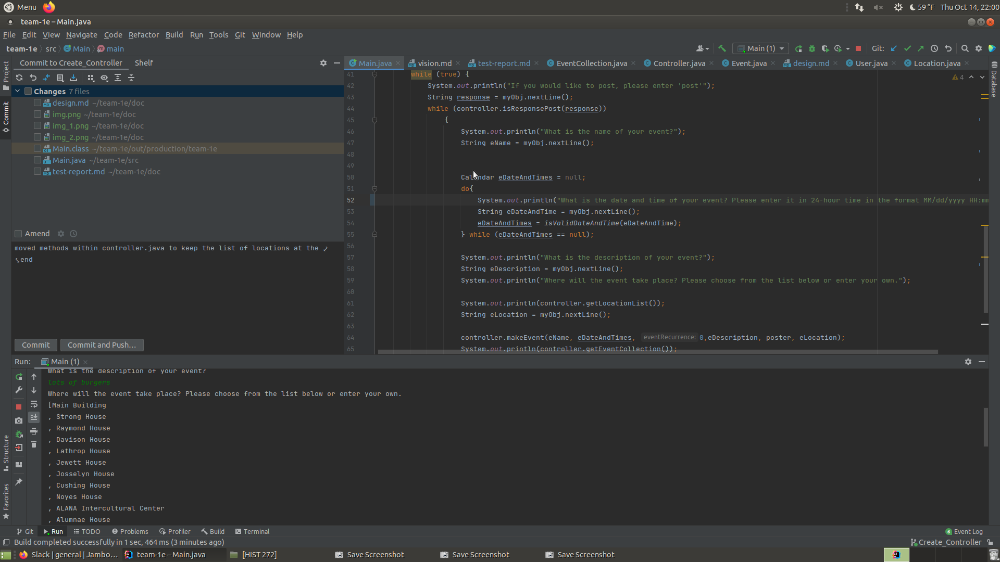

# Test Report
It first asks for the name, which is the text-based UI version of logging in.
The first “official” test was with no inputs because the program shows the list of all the events (eventCollection) by default. 

In the case that there are no events, the program should write that there exists no events and suggest the user to post an event. That's what it did and so it passed the test.

In the case that the user wants to post something, when the user types “post” it should begin the series of questions that asks for details of the event. It successfully asked these questions.
Regardless of whether the word “post” was capitalized or not it should still recognize the word post; which it did.

The program then asked for a date and time. The program successfully asked 
for both the date and time, but we fed it a purposefully invalid date to see
what would happen. The system handled the error well, so we gave it a valid
date and moved on.

The description of the event was left as a string and the user can describe it however they feel appropriate.

Location: The user was given a list of locations around the campus that were the most popular. However, the user can also input a new location.

We tested by selecting locations that were given (by typing the string of the location - 
which will be replaced by a dropdown menu potentially in UI); it was accurately displayed
We also chose to add a new location; it also passed the test and was accurately displayed.

By accurately displaying we mean that at the end of the test when the eventCollection is shown, the correct value of the location was saved into the collection.
This was the end of the questionnaires for the event; after this question, it displayed the full list of event collections. This is the main test to see if all the values were correctly passed through and displayed on this event collection, which they did.
Whenever the user wants to post; they can type “post” and it will start this looping again. We tried this iteration three times - it displayed perfectly. 

I attempted to add more images here but for some reason was unable to.

