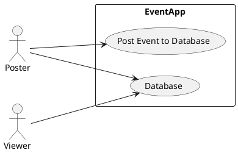

# Overview 
We envision a crowdsourcing app where people would share information about how full/active/vibrant different parts of campus are at 
any given moment. Could eventually be used to organize/promote events around campus. Can be extended to other schools.

# Business Case
Our software addresses customer needs that other products do not:
1. It can enable students to notify the campus community for events.
2. It allows other students to see what events are taking place on campus as well.
3. Saves information on each activity and updates based on user input
4. Allows users to upvote and downvote events based on their credibility.
5. It integrates with some background information of each user to quantify the reliability of an event.

# Key Features
- Creating a login so that credited students are the only ones who have access
- Displaying a map of the locations of events on campus.
- Allowing users to upload information on a future event.
- Allowing users to view events that are already happening on campus.
- An upvote and downvote mechanism that can be saved to identify the reliability of a user.
- One constraint that we have is that we want the time of the app to be as fast as possible, tht is,
  make it work in less than three seconds to upload and view an event.
- Making a database that can keep track of users and verify that students are using the app.
# UML Diagram

# Files
- #Use case list folder 
Will provide a list of development goals that our team has for the project.
- #Supplementary Specification
Additional specifications that our team views as functions that are not requirements,
but that would be nice to have in addition to our project.
- #Glossary:
A list of terms that may be useful to understand the development of our app
and its features.
- #Iteration Plan
Our iteration plan will contain the path of our development.  In addition, it will include
the order that we plan to make progress.