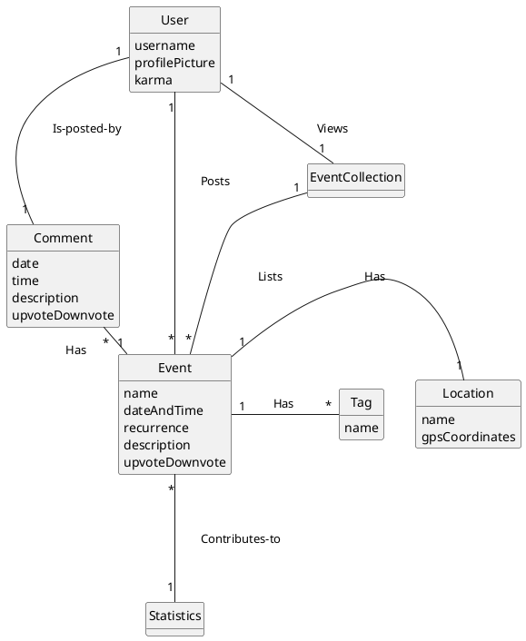
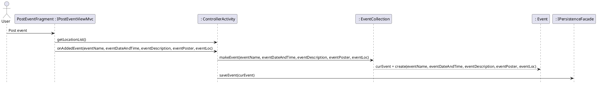
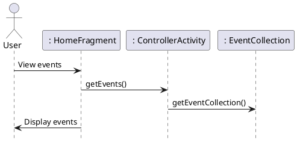
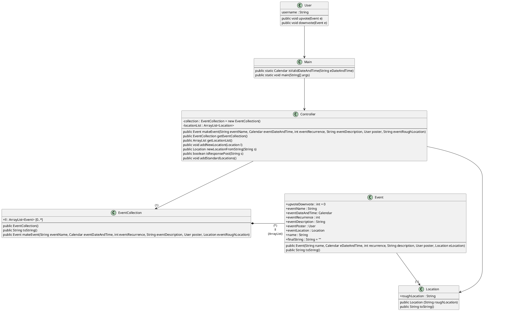

# Domain Model

```plantuml
@startuml

hide circle
hide empty methods

' classes
class User{
username
profilePicture
karma
}
class EventCollection{
}
class Event{
name
dateAndTime
recurrence
description
upvoteDownvote
}
class Tag{
name
}
class Location{
name
gpsCoordinates
}
class Comment{
date
time
description
upvoteDownvote
}
class Statistics{
}

' associations
User "1" -- "1" EventCollection : \tViews\t\t
User "1" - "*" Event : \tPosts\t\t
EventCollection "1" -- "*" Event : \tLists\t\t
Event "1" - "1" Location : \tHas\t\t
Event "1" - "*" Tag : \tHas\t\t
Event "1" -left- "*" Comment : \tHas\t\t
Comment "1" -up- "1" User : \tIs-posted-by\t\t
Event "*" --- "1" Statistics : \tContributes-to\t\t

@enduml
```

# Posting an Event: A Sequence Diagram

```plantuml

@startuml
hide footbox
actor User as user
participant "PostEventFragment : IPostEventViewMvc" as postFrag
participant " : ControllerActivity" as cont
participant " : EventCollection" as coll
participant " : Event" as event
participant " : IPersistenceFacade" as persFacade


user -> postFrag: Post event
postFrag -> cont: getLocationList()
postFrag -> cont: onAddedEvent(eventName, eventDateAndTime, eventDescription, eventPoster, eventLoc)
cont -> coll : makeEvent(eventName, eventDateAndTime, eventDescription, eventPoster, eventLoc)
coll --> event : curEvent = create(eventName, eventDateAndTime, eventDescription, eventPoster, eventLoc)
cont ->  persFacade : saveEvent(curEvent)


@enduml
```

# Viewing Events: A Sequence Diagram

```plantuml
@startuml
hide footbox
actor User as user
participant " : HomeFragment" as homeFrag
participant " : ControllerActivity" as cont
participant " : EventCollection" as coll

user -> homeFrag: View events
homeFrag -> cont: getEvents()
cont -> coll: getEventCollection()

homeFrag -> user: Display events

@enduml
```

# Class Diagram

```plantuml
@startuml
skinparam classAttributeIconSize 0

class User{
username : String
--
public void upvote(Event e)
public void downvote(Event e)
}

class EventCollection{
+ ll : ArrayList<Event> [0..*]
--
public EventCollection()
public String toString()
public Event makeEvent(String eventName, Calendar eventDateAndTime, int eventRecurrence, String eventDescription, User poster, Location eventRoughLocation)
}

class Event{
+ upvoteDownvote : int = 0
+ eventName : String
+ eventDateAndTime: Calendar
+ eventRecurrence : int
+ eventDescription : String
+ eventPoster : User
+ eventLocation : Location
+ name : String
+ finalString : String = ""
--
public Event(String name, Calendar eDateAndTime, int recurrence, String description, User poster, Location eLocation)
public String toString()
}

class Location{
+ roughLocation : String
--
public Location (String roughLocation)
public String toString()
}

class Main{
--
public static Calendar isValidDateAndTime(String eDateAndTime)
public static void main(String[] args)
}

class Controller{
- collection : EventCollection = new EventCollection()
- locationList : ArrayList<Location>
--
public Event makeEvent(String eventName, Calendar eventDateAndTime, int eventRecurrence, String eventDescription, User poster, String eventRoughLocation)
public EventCollection getEventCollection()
public ArrayList getLocationList()
public void addNewLocation(Location l)
public Location newLocationFromString(String s)
public boolean isResponsePost(String s)
public void addStandardLocations()
}

User ---> Main : \t\t\t\t

Main ---> Controller : \t\t\t\t

Controller ---> "(1)" EventCollection : \t\t\t\t

EventCollection *- "(*)\nll\n{ArrayList}" Event : \t\t\t\t

Controller ---> Location : \t\t\t\t

Event ---> "(1)" Location : \t\t\t\t

@enduml
```
