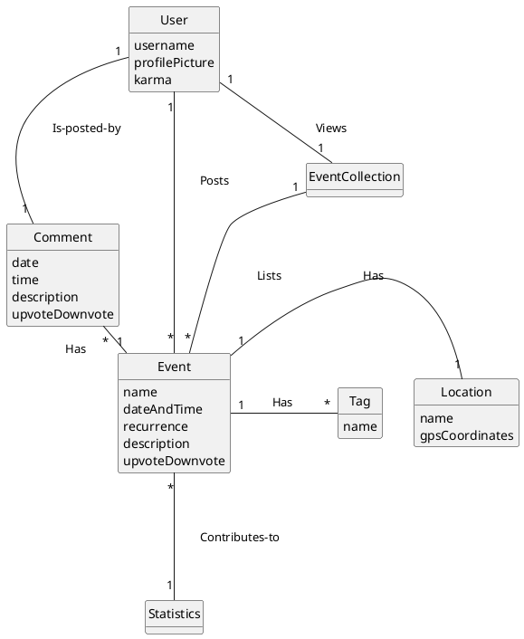
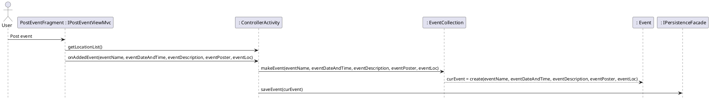
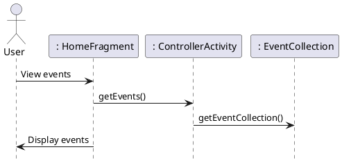
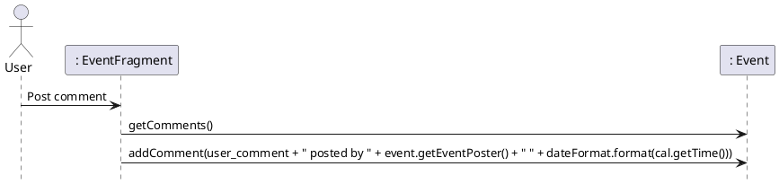
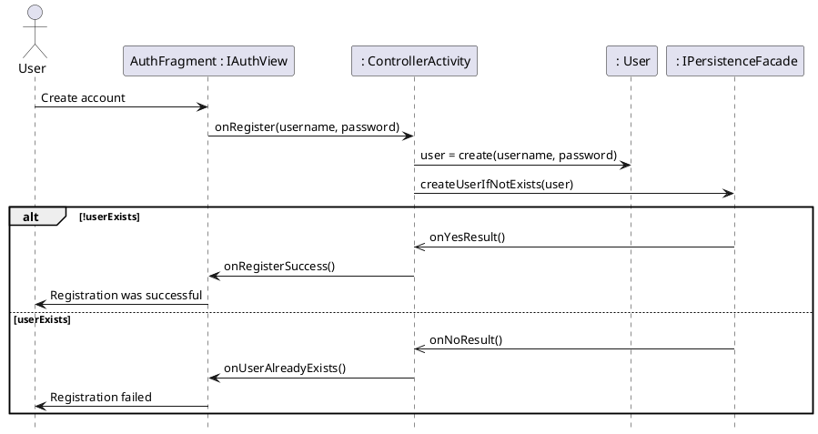
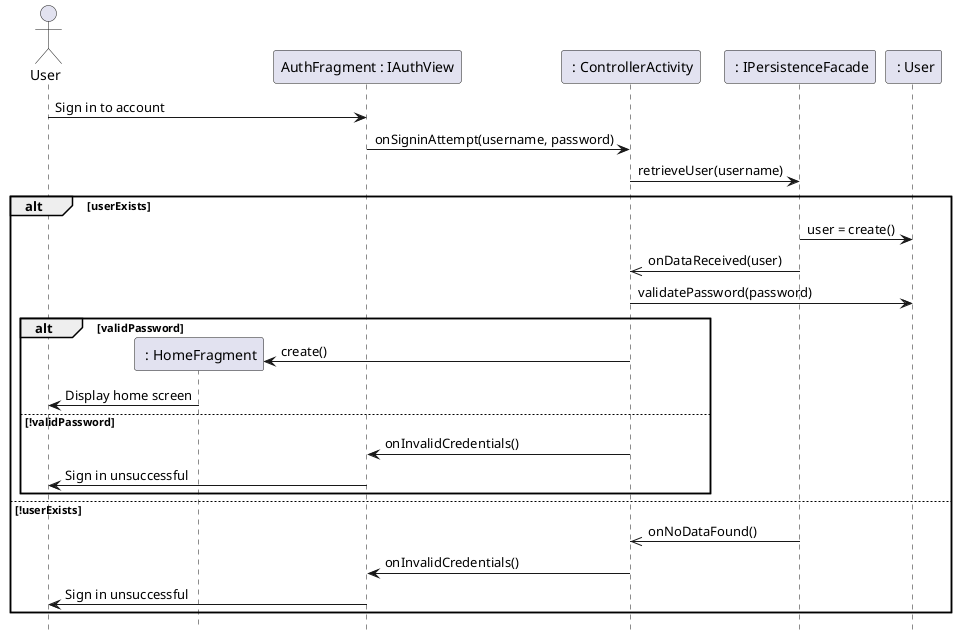

# Domain Model

# Posting an Event: A Sequence Diagram

# Viewing Events: A Sequence Diagram

# Comment on Event: A Sequence Diagram

# Creating Account: A Sequence Diagram

# Sign In to Account: A Sequence Diagram

# Class Diagram

```plantuml
@startuml
skinparam classAttributeIconSize 0

class User{
username : String
- authKey : AuthKey
--
public User(String username)
public User()
public User(String username, String password)
public String getUsername()
public AuthKey getAuthKey()
public boolean validatePassword(String password)
public void upvote(Event e)
public void downvote(Event e)
public String toString()
public String UserString()
}

class EventCollection{
- ll : ArrayList<Event> [0..*]
--
public EventCollection()
public String toString()
public void addEvent(Event event)
public Event makeEvent(String eventName, String eventDateAndTime, String eventDescription, String eventPoster, String eventRoughLocation)
public ArrayList<Event> getEventCollection()
public Event getEvent(int i)
public ArrayList<Event> findUsersEvents(String username)
public void handleRecurrence(Event e, Calendar c, String howOften, int howManyTimes, int howManySkip)
public Calendar assignYearMonthDay(Calendar c, int year, int month, int day)
private int getWeekOfDateInMonth(Calendar c)
public String convertCalendarToString(Calendar c)
public String addZero(int x)
public ArrayList<Event> orderEvents()
}

class Event{
upvoteDownvote : int = 0
eventName : String
eventDateAndTime: String
eventRecurrence : int
eventDescription : String
eventPoster : String
poster : User
eventLocation : String
name : String
allDatesAndTimes : List<String> = new ArrayList<String>()
comments : List<String> = new ArrayList<String>()
id : String
--
public Event(String name, String eventDateAndTime, String description, String eventPoster, String eLocation)
public Event()
public void addNewDateAndTime(String c)
public List<String> getAllDatesAndTimes()
public String toString()
public String toStringExtended()
public void addComment(String s)
public List<String> getComments()
public String getEventPoster()
public String getEventName()
public String getEventDateAndTime()
public String getEventLocation()
public String getEventDescription()
public void setId(String id)
public String getId()
public Calendar getFirstDay() throws exception ParseException
}

class Location{
roughLocation : String
--
public Location (String roughLocation)
public String toString()
public static ArrayList<Location> getLocationList()
}

class AuthKey{
- salt : String
- key : String
--
public AuthKey()
public AuthKey(String password)
private AuthKey(String salt, String password)
public String getSalt()
public String getKey()
public boolean validatePassword(String password)
public String toString()
private static String generateSalt()
private static String generateKey(String salt, String password)
}

class Username{
- username : String
- authKey : AuthKey
--
public Username()
public Username(String username, String password)
public String getUsername()
public AuthKey getAuthKey()
public boolean validatePassword(String password)
public String toString()
}


class ControllerActivity{
- collection : EventCollection
- locationList : ArrayList<Location> = Location.getLocationList()
- bottomNavigationView : BottomNavigationView
- mainView : IMainView
{static} - CUR_EVENT : String = "curEvent"
{static} - CUR_USER : String = "curUser"
- persistenceFacade : IPersistenceFacade = new FirestoreFacade()
- User curUser
- Event curEvent
--
protected void onCreate(Bundle savedInstanceState)
public void onSaveInstanceState(@NonNull Bundle outState)
public ArrayList<Event> getEvents()
public void onItemClick(View view, int position)
public void onPostButton()
public void onDateButton(String eventDate)
public void onTimeButton(String eventDateAndTime)
public void onRecurrenceButton(Calendar eventDate)
public void onTimeButtonRecucrrence(Calendar eventDate, String howOften, int howMany, int howManySkipped)
public void onRecurrenceSelected(Calendar eventDate, String howOften, int howMany, int howManySkipped)
public void onAddedButton()
public EventCollection onAddedRecurrence(String eventName, String eventDateAndTime, String eventRoughLocation, String eventPoster, String eventDescription, Calendar c, String howOften, int howMany, int howManySkip)
public void onCommentAdded(String comment, Event event)
public EventCollection onAddedEvent(String eventName, String eventDateAndTime, String eventRoughLocation, String eventPoster, String eventDescription)
public ArrayList<Location> getLocationList()
public void onMapSelected()
public void onHomeSelected()
public void onProfileSelected()
public void onRegister(String username, String password, IAuthView authView)
public void onSigninAttempt(String username, String password, IAuthView authView)
public void onNewEvent()
public EventCollection getEventCollection()
public void onPointerCaptureChanged(boolean hasCapture)
}


class FirestoreFacade{
db : FirebaseFirestore = FirebaseFirestore.getInstance()
{static} - USERS : String = "users"
{static} - EVENT_COLLECTION : String = "event collection"
--
public void saveEvent(@NonNull Event event)
public void saveComment(@NonNull Event event)
public void retrieveEventCollection(@NonNull DataListener<EventCollection> listener)
public void createUserIfNotExists(@NonNull User user, @NonNull BinaryResultListener listener)
private void setUser(@NonNull User user, @NonNull BinaryResultListener listener)
public void retrieveUser(@NonNull String username, @NonNull DataListener<User> listener)
}

interface IPersistenceFacade{
--
void saveComment(Event event)
void saveEvent(@NonNull Event event)
void retrieveEventCollection(@NonNull DataListener<EventCollection> listener)
void createUserIfNotExists(@NonNull User user, @NonNull BinaryResultListener listener)
void retrieveUser(@NonNull String username, @NonNull DataListener<User> listener)
}


class AddDateFragment{
listener : IPostEventViewMvc.Listener
binding : FragmentAddDateBinding
--
public AddDateFragment(IPostEventViewMvc.Listener listener)
public View onCreateView(@NonNull LayoutInflater inflater, @Nullable ViewGroup container, @Nullable Bundle savedInstanceState)
public void onViewCreated(View view, Bundle savedInstanceState)
public String addZero(int x)
}

class AddTimeFragment{
listener : IPostEventViewMvc.Listener
binding : FragmentAddTimeBinding
eventDateString : String
howOften : String
howMany : int
howManySkipped : int
secondConstructorUsed : boolean = false
eventDate : Calendar = Calendar.getInstance()
--
public AddTimeFragment(IPostEventViewMvc.Listener listener, String eventDateString)
public AddTimeFragment(IPostEventViewMvc.Listener listener, Calendar eventDate, String howOften, int howMany, int howManySkipepd)
public View onCreateView(@NonNull LayoutInflater inflater, @Nullable ViewGroup container, @Nullable Bundle savedInstanceState)
public void onViewCreated(View view, Bundle savedInstanceState)
public String addZero(int x)
}

class AuthFragment{
{static} - IS_REGISTERED : String = "isRegistered"
- listener : Listener
- binding : FragmentAuthBinding
- isRegisterd : boolean = false
--
public AuthFragment(@NonNull Listener listener)
public View onCreateView(@NonNull LayoutInflater inflater, @Nullable ViewGroup container, @Nullable Bundle savedInstanceState)
public void onViewCreated(View view, Bundle savedInstanceState)
public void onSaveInstanceState(@NonNull Bundle outState)
public void onRegisterSuccess()
private void activateRegisteredConfig()
public void onUserAlreadyExists()
private void displayMessage(int msgRid)
}

class EventAdapter{
- events : ArrayList<Event>
- binding : FragmentHomeBinding
- inflater : LayoutInflater
- mClickListener : PostEventFragment.Listener
- iClickListener : ItemClickListener
--
public EventAdapter(Context context, ArrayList<Event> events)
public View onCreateViewHolder(ViewGroup parent, int viewType)
public void onBindViewHolder(ViewHolder holder, int position)
public int getItemCount()
public Event getItem(int id)
public void setClickListener(ItemClickListener itemClickListener)
}

class EventFragment{
event : Event
listener : IPostEventViewMvc.Listener
binding : FragmentEventBinding
inflater : LayoutInflater
--
public EventFragment(IPostEventViewMvc.Listener listener, int i)
public View onCreateView(@NonNull LayoutInflater inflater, @Nullable ViewGroup container, @Nullable Bundle savedInstanceState)
public void onViewCreated(View view, Bundle savedInstanceState)
public void onEventCollectionUpdated(EventCollection eventCollection)
}

class HomeFragment{
adapter : EventAdapter
binding : FragmentHomeBinding
listener : IPostEventViewMvc.Listener
inflater : LayoutInflater
eFragment : EventFragment
mainBinding : MainBinding
activity : ControllerActivity
--
public HomeFragment(IPostEventViewMvc.Listener listener)
public View onCreateView(@NonNull LayoutInflater inflater, @Nullable ViewGroup container, @Nullable Bundle savedInstanceState)
public void onViewCreated(View view, Bundle savedInstanceState)
public void onItemClick(View view, int position)
}

class MainView{
mainBinding : MainBinding
activity : ControllerActivity
--
public MainView(ControllerActivity activity)
public View getRootView()
public void displayFragment(Fragment fragment)
public Fragment getCurrentFragment()
}

class MapsFragment{
activity : ControllerActivity
binding : FragmentMapsBinding
map : GoogleMap
--
public MapsFragment(ControllerActivity activity)
private OnMapReadyCallback callback = new OnMapReadyCallback()
public View onCreateView(@NonNull LayoutInflater inflater, @Nullable ViewGroup container, @Nullable Bundle savedInstanceState)
public void onViewCreated(View view, Bundle savedInstanceState)
}

class PostEventFragment{
listener : Listener
binding : FragmentPostEventBinding
eventPoster : String
eventDateAndTime : String
ev : EventCollection
currentCal : Calendar = Calendar.getInstance()
howOften : String
howMany : int
howManySkipped : int
secondConstructorUsed : boolean = false
--
public PostEventFragment(Listener listener, String eventPoster, String eventDateAndTime)
public PostEventFragment(Listener listener, String eventPoster, EventCollection eventCollection, Calendar eventDate, String howOften, int howMany, int howManySkipped)
public View onCreateView(@NonNull LayoutInflater inflater, @Nullable ViewGroup container, @Nullable Bundle savedInstanceState)
public void onViewCreated(View view, Bundle savedInstanceState)
public String addZero(int x)
public void onSaveInstanceState(@NonNull Bundle outState)
public void onViewStateRestored(@Nullable Bundle savedInstanceState)
}

class ProfileFragment{
binding : FragmentProfileBinding
username : String
ec : EventCollection
filteredEvents : List<Event> = new ArrayList<Event>()
--
public ProfileFragment(EventCollection eventCollection, String username)
public ProfileFragment()
public View onCreateView(@NonNull LayoutInflater inflater, @Nullable ViewGroup container, @Nullable Bundle savedInstanceState)
public void onSaveInstanceState(@NonNull Bundle outState)
public void onViewStateRestored(@Nullable Bundle savedInstanceState)
}

class RecurrenceFragment{
listener : IPostEventViewMvc.Listener
binding : FragmentRecurrenceBinding
curEventDate : Calendar = Calendar.getInstance()
--
public RecurrenceFragment(Listener listener, Calendar eventDate)
public View onCreateView(@NonNull LayoutInflater inflater, @Nullable ViewGroup container, @Nullable Bundle savedInstanceState)
public void onViewCreated(View view, Bundle savedInstanceState)
}

@enduml
```

